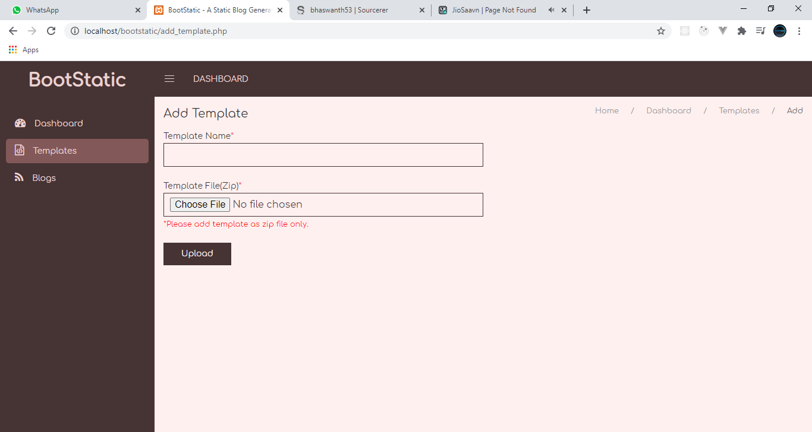

# BootStatic

Bootstatic is a static blog generator which will generate all pages in blog as pure **HTML** pages.


A blog is a platform to share our knowledge, boost SEO of the site and increase the reputation. Creating a blog may not a difficult task these days for anyone, but to host the blog, we need a perfect hosting server which we need to purchase.

This project was developed for people who want to reduce their cost from purchasing high-end servers to maintain their blogs.

This project is mainly focused on rendering blogs as static html pages.

## Themes

Themes are the designs of blog pages (i.e., Blog Index and Post page). We can design whatever theme we want and however we like and upload it to this project.

Steps to add templates:

1. Create your template in the given structure.
2. Add demo pages and add bootstatic **keywords** in your template main pages.
3. Zip your template as **.zip** file.
4. Go to **Bootstatic->Templates->Add New**.
5. Add Template Name and Upload your template.



Done! Your template has been added.

### Template Structure

```
assets*
    |_ css*
    |_ js*
    |_ media*
demo*
    |- index.html
    |- post.html
posts*
    |- post.html
chunk.html
index.html

* -> Folder
```

- **assets** : This is the folder where all css, js and static media files will be stored.
- **demo** : This folder contains two files index.html and post.html. These are static pages with the final look of the template with suome dummy data.
- **posts** : This folder contains individual post page names post.html. All the individual post pages in the blog page will be generated using this page.
- **chunk.html** : This HTML page contains post section content which is displayed in listing page. For example every post displayed on the listing page will be generated using this file.
- **index.html** : This is the main index page of a blog which contains post listing.

## Blog

Once the template is uploaded, we can check it in the application. 

Then we can create a blog using that template.

1. Go to **Bootstatic->Blogs->Add New**.
2. Select Template.
3. Fill the below details
    - **Blog Name** : Name of the blog.
    - **Blog Title** : Meta title of the blog index page.
    - **Blog Description** : Meta description of the blog index page.
    - **Blog Keywords** : Meta keywords of the blog (sepearte with comma).
    - **Blog Head** : If you want to add any script or any other meta tags in ``` <head> ``` section, then you can add that here. If not, leave it empty.
    - **Blog Foot** : If you want to add any script or any other meta tags in ``` <body> ``` section, then you can add that here. If not, leave it empty.
4. Create blog.
5. Once you created the blog, the preview will be as shown below.


Then you can add post content and post page data in **Add Post** page.


Then you can **Export Blog** and for every new post add, you can also **Update Blog**. Once your blog is updated, then all the posts and index page will be regenerated with new content.

You can also download your blog as a zip file.

Every blog has unique **id** number.

Once you exported your blog, it will be stored as **Bootstatic->build->(Your blog id number)** folder.


## Keywords

### index.html

Keyword | Description
--|--
{{ blog_title }} | Meta title of index page
{{ blog_description }} | Meta Description
{{ blog_keywords }} | Meta Keywords
{{ blog_head }} | Head section content
{{ blog_foot }} | Body section scripts and  content
{{ post_listing }} | Post listing

### chunk.html

Keyword | Description
--|--
{{ post_image }} | Replace with `````` tag of post image.
{{ post_title }} | Post Title.
{{ post_date }} | Post Published Date.
{{ post_chunk_content }} | Shot text for post listing.
{{ post_link }} | URL of the post page.

### post.html

Keyword | Description
--|--
{{ page_title }} | Meta Title
{{ page_description }} | Meta Description
{{ page_keywords }} | Meta Keywords
{{ post_image }} | Post Image
{{ post_title }} | Post Title
{{ post_date }} | Post Published Description
{{ post_content }} | Post Content


See the Template Demo: [https://github.com/bhaswanth53/BootStatic-Template-Demo](https://github.com/bhaswanth53/BootStatic-Template-Demo)